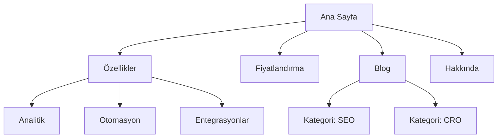
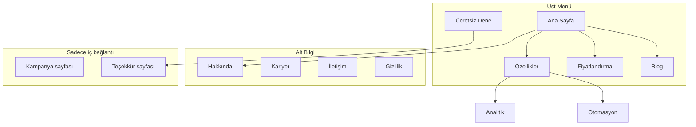
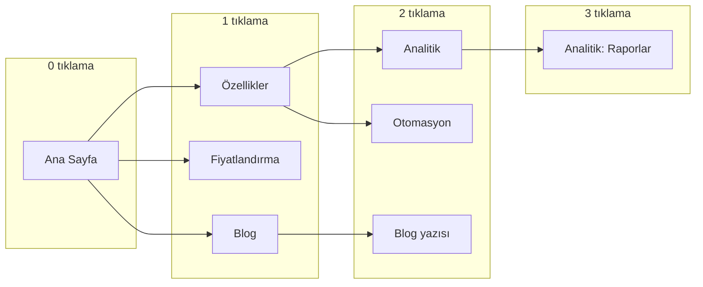
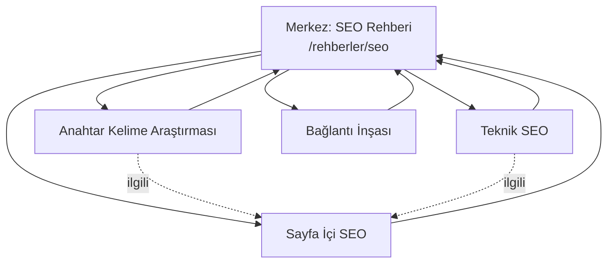
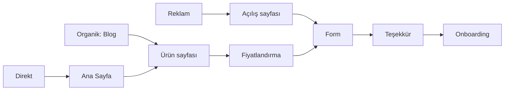
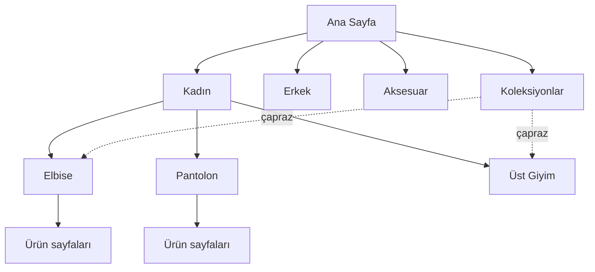

# Mermaid Site Haritası Şablonları

## 1. Temel Hiyerarşi



Ne zaman: hızlı yapı taslağı, ekiple ilk konuşma.

---

## 2. Navigasyon Bölgeli

Hangi sayfanın nerede göründüğünü gösterir — üst menü, alt bilgi, gizli.



Ne zaman: navigasyon spesifikasyonu sunarken; "bu sayfa menüde mi" tartışmasını bitirir.

---

## 3. Tıklama Mesafesi

Her seviyeyi ayrı katmanda gösterir — 3 tıklama kuralını denetlemek için.



Ne zaman: yeniden yapılandırmada gömülü sayfaları görünür kılmak için. 4. sütun oluşuyorsa yapıyı düzleştir.

---

## 4. Merkez–Uç (İç Bağlantı)



Düz ok: merkezden uca ve uçtan merkeze. Kesikli ok: uçlar arası ilgili bağlantı.
Ne zaman: içerik kümesi planlarken.

---

## 5. Dönüşüm Akışı

Sayfa yapısını değil, kullanıcının yolunu gösterir.



Ne zaman: sitenin iş hedefine hizmet edip etmediğini tartışırken. Yapı doğru ama dönüşüm yoksa sorun genelde burada görünür.

---

## 6. Yeniden Yapılandırma: Eski → Yeni

```mermaid
graph LR
    subgraph "Eski yapı"
        O1[/urunler/analitik]
        O2[/product/automation]
        O3[/blog/2024/01/seo-yazisi]
    end

    subgraph "Yeni yapı"
        N1[/ozellikler/analitik]
        N2[/ozellikler/otomasyon]
        N3[/blog/seo-yazisi]
    end

    O1 -->|301| N1
    O2 -->|301| N2
    O3 -->|301| N3
```

Ne zaman: geçiş planını onaya sunarken. Her okun bir 301 yönlendirme satırı olduğunu gösterir.

---

## 7. E-ticaret Kategori Ağacı



Kesikli ok: koleksiyon sayfalarının kategorilerle çapraz ilişkisi — aynı ürün iki yerden erişilebilir, ama **tek canonical URL** olmalı.

---

## Biçim Notları

- **`graph TD`** (yukarıdan aşağı) hiyerarşi için; **`graph LR`** (soldan sağa) akış ve tıklama mesafesi için
- Düğüm etiketinde URL göstermek istersen `<br/>` ile alt satıra al
- Türkçe karakterler etiket içinde sorunsuz; **düğüm kimliklerinde (ID) kullanma** — `FEAT` iyi, `ÖZELLİK` riskli
- Çok büyük siteyi tek diyagrama sığdırmaya çalışma; bölüm bölüm ayrı diyagram üret
- Artifact olarak yayınlanan sayfalarda mermaid doğrudan render edilir; sohbete gönderilen HTML dosyasında renderer script'i gömülmelidir
